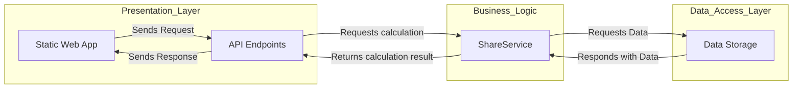

# Cost Accounting

## Overview

This project is a C# application for performing FIFO-based cost accounting calculations on stock sales. It calculates the following based on user input:

- The remaining number of shares after the sale
- The cost basis per share of the sold shares
- The cost basis per share of the remaining shares after the sale
- The total profit or loss of the sale


The application uses hard-coded data for stock purchases and allows users to specify the number of shares sold and the sale price.

## Project Structure

- `src/` - Contains the main source code files organized by layers (e.g., Business Logic, Data Access, and Presentation).
- `tests/` - Holds tests for verifying calculation correctness and application functionality.

## Architecture
The application follows a three-tiered architecture consisting of the following layers:

- **Presentation Layer:** Static Web Files: client interface to interact with the API for visualizing share calculations and API to 
handle HTTP requests and responses, providing endpoints for calculating share metrics.
- **Business Logic Layer:** Contains business logic and interacts with repositories and strategies to perform calculations.
- **Data Access Layer:** Abstracts access to the data source (e.g., a database or in-memory storage).



## Data Setup

The application uses hardcoded share data for calculations. These initial values represent shares acquired on different dates with varying quantities and prices:

| Investment Date | Quantity | Price Per Share |
|-----------------|----------|-----------------|
| 1/1/2024        | 100      | $20.00         |
| 2/1/2024        | 150      | $30.00         |
| 3/1/2024        | 120      | $10.00         |

## Requirements

- [.NET 8.0 SDK](https://dotnet.microsoft.com/en-us/download/dotnet/8.0) or later.

## Installation
To run this project locally:
1. Clone the repository:
```shell
git clone https://github.com/olehrechukh/costAccounting
```
2. Navigate to the project directory:
```shell
cd costAccounting
```
3. Install dependencies:
```shell
dotnet restore
```
4. Install dependencies:
```shell
dotnet run --project .\src\Web\Web.csproj
```
Open the application in your browser:
```url
http://localhost:5224
```
## Testing
The project includes unit and integration tests the functionality of the core components.

- To run the tests, use the following command:
```shell
dotnet test
```